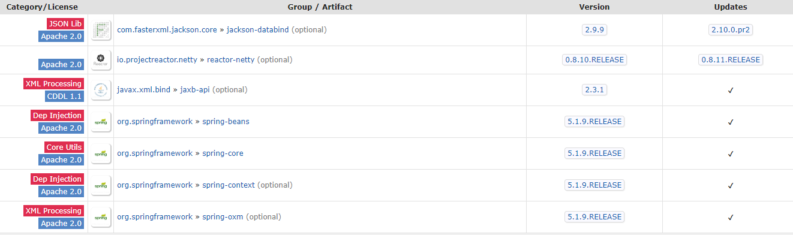
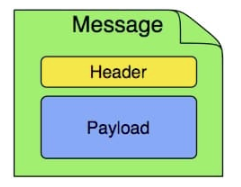

[spring-messaging](https://github.com/spring-projects/spring-framework/tree/master/spring-messaging)的源码在spring-framework项目中,属于spring-framework项目中的一个组件

看项目依赖图纸依赖了spring的核心包


Spring Messaging 是 Spring Framework 中的一个模块，其作用就是统一消息的编程模型。

+ 消息`Messaging` 对应的模型就包括一个消息体 Payload 和消息头 Header:

```java
package org.springframework.messaging;
public interface Message<T> {
    T getPayload();
    MessageHeaders getHeaders();
}
```
+ 消息通道 `MessageChannel` 用于接收消息，调用 send 方法可以将消息发送至该消息通道中 :

```java
@FunctionalInterface
public interface MessageChannel {
    long INDEFINITE_TIMEOUT = -1;
    default boolean send(Message<?> message) {
        return send(message, INDEFINITE_TIMEOUT);
    }
    boolean send(Message<?> message, long timeout);
}
```
